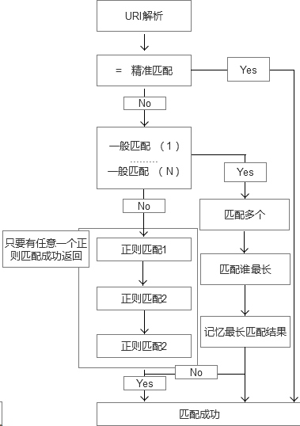

# nginx 简介

高性能WEB服务器

Nginx ('engine x') 是一个高性能的HTTP和反向代理服务器，也是一个  IMAP/POP3/SMTP 代理服务器.
Nginx 是由Igor Sysoev为额落实访问量第二的`Rambler.ru` 站点开发的.


## 编译安装：
```
root@# yum install pcre #先安装pcre,正则表达式的库
root@# ./configure --prefix=/usr/local/nginx
root@# make && make install
root@# cp /usr/local/nginx/conf/nginx.conf.default /usr/local/conf/nginx.conf
```

查看`nginx`文件底下目录:
```
conf // 配置文件目录
html // 放置网页文件
logs // 日志目录
sbin // 主要二进制程序文件
```

> 启动nginx

```
> ./sbin/nginx
```

报错：
```
[root@localhost nginx]# ./sbin/nginx 
nginx: [emerg] bind() to 0.0.0.0:80 failed (98: Address already in use)
nginx: [emerg] still could not bind()
```
不能绑定80端口，80端口已经被占用.
解决，把占用80端口的软件或服务关闭即可.

```
> kill -9 标识
> pkill -9 服务
> pkill -9 http
```

## 编译PHP
```
./configure --prefix=/usr/local/php --enable-fpm
cp /source-path/php.ini-development /usr/local/php/lib/php.ini
```

# 信号量

nginx有两个进程，主进程`msater`进程。主进程不直接响应浏览器，是管理子进程使用。
浏览器访问会到子进程中响应。

```
> kill -INT pid（进程号）
```
-----
```
> ps aux | grep nginx  // 查看进程号
```

| 参数    |    意义    |
| --------    |  :----  |
| TERM,INT    | Quick shutdown （赶紧销毁进程）    |
| QUIT    | Graceful shutdown （优雅的关闭进程，即等待请求结束后再关闭）    |
| HUP    | Configuration reload ,Start the new worker processes with a new configuration Gracefully shutdown the old worker processes 改变配置文件,平滑的重读配置文件 | 
| USR1    | Reopen the log files 重读日志，在日志按月/日分割时有用     |
| USR2    | Upgrade Executable on the fly 平滑的升级 (升级nginx)    | 
| WINCH    | Gracefully shutdown the worker processes 优雅关闭旧的进程(配合USR2来进行升级)    | 

```
> kill -信号选项 nginx的主进程号
> kill -HUP 1480  （修改配置文件并不需要重启服务器，才能生效）
```

在linux中，一个文件对应一个节点`inode`,`inode`是文件真正在磁盘上的位置。文件名字是表现。
日志需要备份，文件在被nginx进程所打开，不能使用`mv`命令。 
除了使用`mv`命令，还需要建立新的文件，同时需要告知nginx服务器，来读取最新的日志文件。

```
> kill -信号控制 `cat /xxx/path/log/nginx.pid`
> kill -USR1 1480
> kill -USR1 `cat /xxx/path/log/nginx.pid`
> kill -USR1 `cat /usr/local/nginx/logs/nginx.pid`
```
-----
```
> ./sbin/nginx  -h

> ./sbin/nginx -s reload // 关闭
> ./sbin/nginx // 开启
> ./sbin/nginx -s reopen // 重读日志，相当于 // kill -USR1 `cat /usr/local/nginx/logs/nginx.pid`
> ./sbin/nginx -t // 检查日志文件是否准确
```

# 虚拟主机配置

> nginx配置段

**全局区**
worker_processes 1; // 有一个工作区域的子进程,可以自行修改，但太大无意义，因为要争夺CPU，一般设置为`CPU数*核数`

```
#user  nobody;
worker_processes  1; # 工作进程,子进程
```

**Evnet区**

一般配置nginx连接的特性
例如，1个worker能同时允许多少链接 

   
> Http段

```
http { // 这是配置http服务器的主要段
	Server1 { // 这是虚拟主机段
		Location { // 定位，把特殊的路径或文件再次定位，如image目录单独处理// 如 .php 单独处理

		}
	}
	Server2 {

	}
}
```


nginx配置文件：
```
#user  nobody;
worker_processes  1; # 工作进程,子进程

#error_log  logs/error.log;
#error_log  logs/error.log  notice;
#error_log  logs/error.log  info;

#pid        logs/nginx.pid;

# 配置nginx连接的特性
events {
# 1个worker能同时允许多少链接 
    worker_connections  1024;  # 这是指 一个子进程最大允许1024个链接
}


# http 段是配置http服务器的主要段
http {
    include       mime.types;
    default_type  application/octet-stream;


    sendfile        on;
    #tcp_nopush     on;

    #keepalive_timeout  0;
    keepalive_timeout  65;

    server { # 这是虚拟主机
        listen       80;
        server_name  localhost;

        #access_log  logs/host.access.log  main;

        location / { #
            root   html;
            index  index.html index.htm;
        #error_page  404              /404.html;

        #
        error_page   500 502 503 504  /50x.html;
        location = /50x.html {
            root   html;
        }

        #
        #}

        #
        #location ~ \.php$ {
        #    root           html;
        #    fastcgi_pass   127.0.0.1:9000;
        #    fastcgi_index  index.php;
        #    include        fastcgi_params;
        #}

        # concurs with nginx's one
        #
        #location ~ /\.ht {
        #    deny  all;
        #}
    }


    #
    #server {
    #    listen       8000;
    #    listen       somename:8080;
    #    server_name  somename  alias  another.alias;

    #    location / {
    #        root   html;
    #        index  index.html index.htm;
    #    }
    #}


    # HTTPS server
    #
    #server {
    #    listen       443;
    #    server_name  localhost;

    #    ssl                  on;
    #    ssl_certificate      cert.pem;
    #    ssl_certificate_key  cert.key;

    #    ssl_session_timeout  5m;

    #    ssl_protocols  SSLv2 SSLv3 TLSv1;
    #    ssl_ciphers  HIGH:!aNULL:!MD5;
    #    ssl_prefer_server_ciphers   on;

    #    location / {
    #        root   html;
    #        index  index.html index.htm;
    #    }
    #}

}
```

简单的虚拟主机配置：

```
server {
	listen 80;
	server_name z.com;
	location / {
		root z.com; # root 路径可以是相对路径 相对nginx安装的根目录
        # 可以是绝对路径   /usr/loca/nginx;
		index index.html index.htm;
	}
}
server {
	listen 2022;
	server_name z.com;
	location / {
		root /home/mm/twinkle/; 
		index index.html index.htm;
	}
}
```

```
> ifconfig // 查看信息
```

# 日志管理

nginx的server段，可以看到的信息有：
`#access_log  logs/host.access.log  main;`该虚拟主机，它的访问日志的文件是`logs/host.access.log` 使用的格式是`main`格式.
除了`main`格式,还可以自定义其它格式.

main格式是什么?
```
#log_format  main  '$remote_addr - $remote_user [$time_local] "$request" '
#                  '$status $body_bytes_sent "$http_referer" '
#                  '"$http_user_agent" "$http_x_forwarded_for"';
```
`main`格式是定义好的一种日志的格式，并起个名字，便于引用.
例如：
`main`类型的日志，记录了`remove_addr...http_x_forwarded_for`等选项.

```
remote_addr // 远程地址
remote_user[$time_local] // 访问远程的时间， 如果访问http头信息没有携带，是空的。
$request  // 请求方法`get` & `post`
$status // 请求状态码 例如：400
$body_bytes_sent // 主体发送的字节
$http_referer // referer头
$http_user_agent // 用户代理/蜘蛛
$http_x_forwarded_for // 被转发的请求原始IP (在经过代理时，代理把本来IP加在此头信息中，传输原始IP. )
```

蜘蛛：搜索引擎的服务器.
[百度robots](https://www.baidu.com/robots.txt)
蜘蛛协议.

Nginx允许针对不同的server做不同的Log(有的web服务器不支持，如：lighttp)

```
access_log logs/z.com.access.log main; // 配置单独的log日志
```

# 定时任务

> shell 脚本

shell 脚本注意空格

变量声明
```
a // 定义
$a // 使用
```

输出执行返回结果
```
echo `date -d yesterday %Y%m%d` // 第一种: ``
echo $(date -d yesterday %Y%m%d) // 第二种: $()
```

日志切割
```
#!/bin/bash
LOGPATH=/usr/local/nginx/logx/z.com.access.log
BASEPATH=/data

bak=$BASEPATH/$(date -d yesterday +%Y%m%d%H%M).zcom.access.log

#echo $bak

mv $LOGPATH $bak
touch $LOGPATH

kill -USR1 `cat /usr/local/nginx/logs/nginx.pid`
```

# Location

`location` 有定位的意思，根据Uri来进行不同定位

在虚拟主机的配置中，是必不可少的location可以把网站的不同部分，定位到不同的处理方式上。
比如。碰到.php，如何调用PHP解释器，这时需要location。

location 的语法
```
location [=|~|~*|^~] patt {
}
```
中括号可以不写任何参数，此时称之为一般匹配
也可以写参数
因此，大类型可以分为3种：
1. location = patt {} [精准匹配]
2. location patt {} [一般匹配]
3. location ~ patt {} [正则匹配]

## 精准匹配

如何发挥作用?

首先看是否有精准匹配，如果有，则停止匹配过程.
```
location = patt {
    config A
}
```
如果 $uri == patt, 匹配成功,使用 `config A`


判断使用的那个location
```
location = / {
    root /var/www/html/;
    index index.htm index.html;    
}
location / {
    root /usr/local/nginx/html;
    index index.html index.htm;
}
```

如果访问的是:`http://www.xxx.com`
定位流程：
1. 精准匹配中 `/`，得到`index` 页为`index.htm`
2. 再次访问 `/index.htm`， 此次内部跳转uri是`/index.htm`,跟目录为`/usr/local/nginx/html`
3. 最终结果，访问了 `/usr/local/nginx/html/index.htm`


精准匹配测试
```
location = /index.htm { // 添加匹配文件，而非目录.
}
location /index.htm {
}
```

`一般匹配`与`精准匹配`冲突时，`精准`发挥作用.

## 正则匹配
 

```
location / {
    root /usr/local/nginx/html;
    index index.html index.htm;
}

location ~ image {
    root /var/www/image;
    index index.html index.htm;
}
```

如果访问： `http://xxx.com/image/a.jpg`
这时，`/`与`/image/a.jpg` 匹配，同时`image`正则与`image/a.jpg`也能匹配，谁发挥作用?

`一般匹配`与`正则匹配`冲突，`正则`发挥作用。

图片真正访问的地址：`/var/www/image/a.jpg`


```
locatiorn / {
  root /usr/loca/nginx/html;
  index index.html index.htm;
}

location /foo {
  root /var/www/html;
  index inde.html
}
```

当访问`http://xxx.com/foo`

对于uri为`/foo`,两个location的patt，都能够匹配。
即`/`能够左前缀匹配，`/foo`也能左前缀匹配.
此时真正访问的是`/var/www/html/foo`.
原因:`/foo`匹配更长，因此使用.

## location整体流程

正则匹配有顺序关系，从上到下.有匹配上的就退出.
普通匹配不需要考虑顺序，挨个匹配，最长的就是匹配上.




location 的匹配过程：
1. 先判断精准匹配，如果匹配成功，立即返回结果并结束解析过程.
2. 判断一般命中，如果有多个命中，`记录`下来`最长`的匹配结果. (注意：记录但不结束，最长为准).
3. 继续正则表达式的解析结果，按配置里的正则表达式顺序为准，由上到下开始匹配，一旦匹配成功，理解返回结果，并结束解析过程.


延伸分析：
* 普通匹配顺序无所谓，是按照匹配长短来确定的.
* 正则匹配是按照顺序来匹配.


# rewrite

rewrite(重写)语法详解

重写的规则可以放在`location`或者`service`中.

常用的命令
1. if 空格 (条件) {} # 设定条件，再进行重写
2. set # 设置变量
3. return # 返回状态码
4. break # 跳出rewrite
5. rewrite # 重写


**if 语法**

```
if 空格 (条件) { // 空格不允许少
    重写默认
}
```

条件写法：
1. `=`来判断相等，用于字符串比较
2. `~`用正则来匹配(区分大小写) , `~*`用来正则匹配(不区分大小写)
3. -f-d-e 来判断是否为文件，为目录，是否存在.

**相等**
```
location / {
  if ($remote_addr = 192.168.1.12) {
      return 403;
  }
  root html;
  index index.html index.htm;
}
```

**正则**
```
location / {
  if ($http_user_agent ~* chrome) {
      rewrite ^.*$ /chrome.html;
      #  不加 break; 会导致循环重定向， 页面现象， 500 内部服务器错误
      break;
  }
  root html;
  index index.html index.htm;
}
```

**-f-d-e**
除了 `nginx.conf`配置文件中可以看到变量
在文件`conf/fastcig.conf`查看全部nginx可以引用的变量.

`$fastcgi_script_name` 当前访问的uri.
例如：`/abc.html`

```
location {
    if (!-e $document_root$fastcgi_script_name) {
      rewrite ^.*$ /404.html;
      break;
    }
    root html;
    index index.html index.htm;
}
```

以`http://xxx.com/abcds.html`,不存在的页面为例.
注意：此处需要加`break`，因为观察访问日志，日志中显示的访问路径，依然是地址栏输入的uri.(GET /abcds.html HTTP/1.1)。
提示：服务器内部的`rewrite`和302跳转不一样。跳转的话是URL变化，重新发送请求404.html,而内部rewrite，仅仅是重新读取404.html的内容，上下文没有变化,就是 `fastcgi_script_name` 仍然是 `/abcds.html`,因此会循环重定向。


**set**
set是设置变量使用，可以达到多条件判断时做标记使用。
达到apache下的`rewrite_condition`的效果。


判断chrome浏览器，并且不用break。
```
if ($http_user_agent ~* chrome) {
  set $ischrome 1;
}

if ($fastcgi_script_name = chrome.html) {
  set $ischrome 0;
}

if ($ischrome 1) {
 rewrite ^.*$ chrome.html;
}
```

# 编译PHP

安装mysql：`yum install mysql mysql-devel`

nginx+php的编译.
apache一般是把php当作自己的一个模块来启动的，而nginx则是把http请求的变量(如get，user_agent等)转发给php进程，即PHP独立进程，与nginx进行通讯.称之为`fastcgi`运行方式.
因此，为此apache所编译的PHP，是不能用于nginx的，需要重新编译。

编译的PHP有如下功能：

1. 链接mysql
2. gd库
3. ttf字体
4. fpm(fastcgi)方式运行.


前期安装
```
> yum install gd
> yum install freetype
> yum install gd-devel
```
配置与安装
```
./configure --prefix=/usr/local/fastphp \
--with-mysql=mysqlnd \
--enable-mysqlnd \
--with-gd \
--enable-gd-native-ttf \
--enable-gd-jis-conv \
--enable-fpm

make && make install
```

编译完毕后：
```
> cp /usr/local/src/php-5.4.19/php.ini-development ./lib/php.ini

> cd etc/
> cp etc/php.fpm.conf.default etc/php-fpm.conf
```

运行：
```
> ./sbin/php-fpm
```

nginx与PHP是相互独立的，PHP以9000端口作为进程独立运行。nginx接收到请求，把请求转给PHP进程
配置核心：把请求的信息转发给9000端口的PHP进程，让PHP进程处理指定目录下的PHP文件.

修改nginx配置文件:`conf/nginx.conf`

```
location ~ \.php$ {
    root           html;
    fastcgi_pass   127.0.0.1:9000; # 发送到9000端口进程
    fastcgi_index  index.php;
    fastcgi_param  SCRIPT_FILENAME  $document_root$fastcgi_script_name;  # 寻找PHP目录地址
    include        fastcgi_params;
}
```

解释:

1. 碰到PHP文件
2. 把根目录定位到html
3. 把请求上下文转交给9000端口的PHP进程。
4. 并告知PHP进程，当前脚本是`$document_root$fastcgi_script_name`(注：PHP会去寻找当前脚本位置，所以脚本位置要指对)
5. PHP处理之后，返回给nginx服务器.

 
# url重写
 
注意：用url重写，正则里如果有`{}`，整个正则需要使用`""`包起来

静态文件地址重写到动态目录地址
例如：`goods-10.html` 重写到 `goods.php?id=10`
```
location /zf {
    rewrite "goods-(\d{1,7}).html" /zf/goods.php?id=$1;
}
```

正则表达式支持`后向引用`

```
location /zf {
	index index.php;
	rewrite goods-([\d]+)\.html$ /zf/goods.php?id=$1;
	rewrite article-([\d]+)\.html$ /zf/article.php?id=$1;
	rewrite category-(\d+)-b(\d+)\.html /zf/category.php?=$1&barnd=$2;
}
```

通过两次路由对比写出正则
```
category.php?id=3&barnd=1&price_min=200&price_max=1700&filter_attr=167.229.202.199
category-3-b2-min200-max700-attr167.229.202.199.html

category-(\d+)-b(\d+)-min(\d+)-max(\d+)-attr([\d\.]+)\.html category.php?id=$1&barnd=$2&price_min=$3&$price_max=$4&filter_attr=$5;
```


